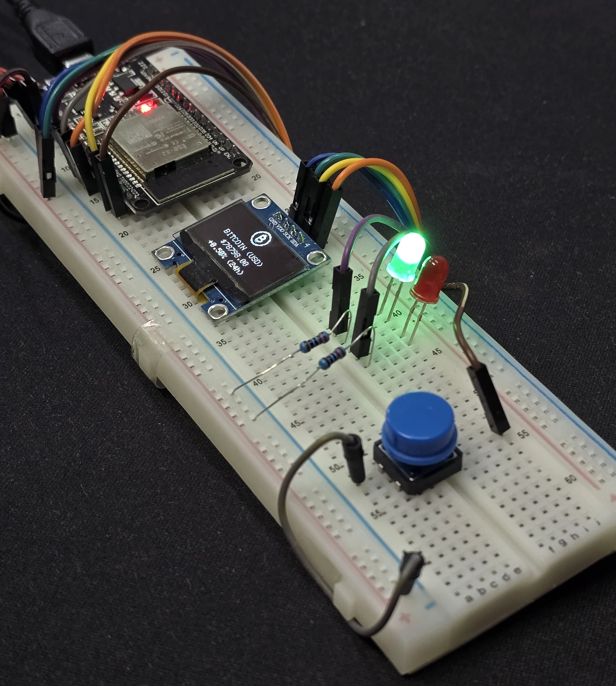
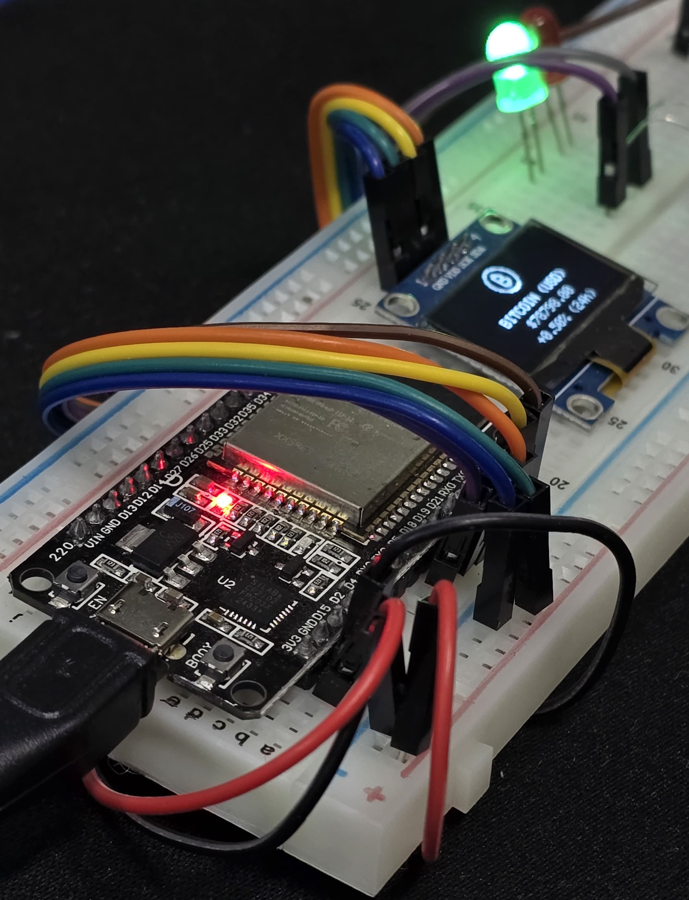
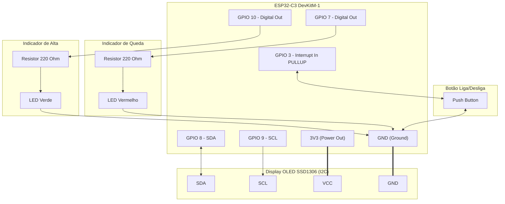
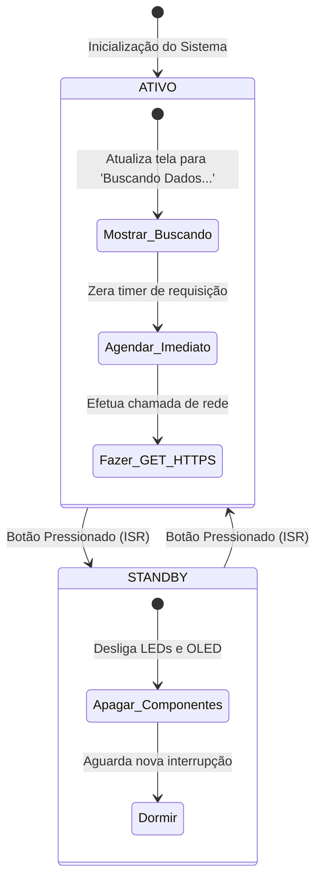
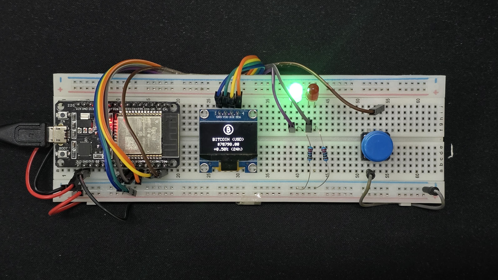

# 🪙 ESP32 IoT Bitcoin Price Tracker & 24h Trend Indicator

Este repositório contém o código-fonte, esquemas de simulação e a documentação completa de um rastreador de preços de Bitcoin (BTC/USD) desenvolvido para microcontroladores da família **ESP32**. 

O dispositivo realiza conexões criptografadas **HTTPS** seguras para consumir dados em tempo real da API pública da **CoinGecko**, processa as informações em formato JSON e as renderiza em um display **OLED SSD1306** via barramento **I2C** com gráficos estilizados. Adicionalmente, LEDs indicadores sinalizam a tendência das últimas 24 horas (alta ou queda).

Este projeto adota **boas práticas de programação de sistemas embarcados**, incluindo:
* Execução assíncrona orientada a eventos (temporização não-bloqueante com `millis()`).
* Tratamento físico de botões por **interrupções externas de hardware (ISR)**.
* Filtro de ruído por software (*debouncing* temporal).
* Isolamento de credenciais privadas em arquivo de configuração separado.
* Tratamento inteligente de perdas de conexão Wi-Fi com fluxo de reconexão automática e cancelamento instantâneo.
* **Abstração de Hardware Multiplataforma**: Uso de um arquivo [config.h](file:///home/victor-meireles/Documents/faculdade/iot/bitcoin-price-tracker/sketch/config.h) centralizado para gerenciar a pinagem entre a placa real e o simulador sem alterar o código principal.

<p align="center"></p>

---

## 🗺️ Índice
1. [Funcionalidades e Recursos](#-funcionalidades-e-recursos)
2. [Arquitetura de Hardware e Pinagem](#-arquitetura-de-hardware-e-pinagem)
3. [Conceitos de IoT e Lógica de Firmware](#-conceitos-de-iot-e-lógica-de-firmware)
4. [Como Executar e Replicar](#-como-executar-e-replicar)
5. [Estrutura do Repositório](#-estrutura-do-repositório)
6. [Dependências e Bibliotecas](#-dependências-e-bibliotecas)

---

## 📌 Funcionalidades e Recursos

* **Segurança HTTPS com Bypass seletivo**: Utiliza `WiFiClientSecure` e `HTTPClient` com `setInsecure()` para requisições HTTPS velozes, evitando o overhead de gerenciar certificados SSL locais que expiram com frequência.
* **Desserialização JSON Eficiente**: Processamento otimizado de payloads HTTP com a biblioteca `ArduinoJson` usando memória estática (`StaticJsonDocument`), garantindo alta velocidade e segurança contra estouro de pilha (*stack overflow*).
* **Interface Gráfica Premium**: Exibição centralizada do preço atual, da variação percentual diária formatada e do ícone estilizado do Bitcoin codificado em bitmap diretamente na memória flash (`PROGMEM`) do microcontrolador.
* **Modo Standby (Espera) Inteligente**:
  * Pressionar o botão desliga instantaneamente o display e os LEDs indicadores, economizando energia e suspendendo as requisições à API.
  * Pressionar novamente reativa o monitoramento e força uma busca imediata dos dados, sem esperar o timer padrão de 1 hora.
* **Resiliência de Rede**: Sistema autônomo que detecta perdas de sinal Wi-Fi, interrompe temporariamente as requisições e executa um loop de reconexão sem travar o microcontrolador, permitindo o cancelamento do processo a qualquer momento via botão de interrupção.

---

## 🔌 Arquitetura de Hardware e Pinagem

Este projeto foi projetado para ser compatível tanto com o **ESP32 Classic** (placa física de desenvolvimento padrão de 30 pinos) quanto com o **ESP32-C3** (placa moderna focada em IoT usada na simulação do Wokwi). 

<p align="center"></p>

> [!NOTE]
> **Abstração de Hardware**:
> Para facilitar o desenvolvimento e testes, criamos o arquivo [config.h](file:///home/victor-meireles/Documents/faculdade/iot/bitcoin-price-tracker/sketch/config.h) que centraliza e permite alternar a pinagem de forma limpa entre o ESP32 físico e o ESP32-C3 simulado no Wokwi apenas alterando a macro ativa.

### Tabela Comparativa de Pinagem

| Componente | Função | Pinos Físicos (ESP32 Classic) | Pinos de Simulação (Wokwi - ESP32-C3) | Tipo de Sinal | Observações |
| :--- | :--- | :--- | :--- | :--- | :--- |
| **OLED SDA** | Barramento de Dados I2C | **GPIO 21** | **GPIO 8** | Digital Bidirecional | Linha de comunicação de dados I2C. |
| **OLED SCL** | Barramento de Clock I2C | **GPIO 22** | **GPIO 9** | Saída de Clock | Sincronismo de clock I2C. |
| **LED Verde** | Sinalizador de Alta | **GPIO 18** | **GPIO 10** | Saída Digital | Ativado se a variação diária for $> 0\%$. Requer resistor de $220\Omega$. |
| **LED Vermelho** | Sinalizador de Queda | **GPIO 19** | **GPIO 7** | Saída Digital | Ativado se a variação diária for $< 0\%$. Requer resistor de $220\Omega$. |
| **Botão Power** | Alterna Standby / Ativo | **GPIO 23** | **GPIO 3** | Entrada Digital | Configurado como `INPUT_PULLUP` (Pressionar leva ao GND). |
| **Alimentação** | Linha de Energia positiva | **3V3** | **3V3** | Alimentação | Tensão operacional do display e LEDs (3.3V). |
| **GND** | Linha de Terra comum | **GND** | **GND** | Referência (0V) | Terra comum a todos os componentes. |

---

### Diagramas de Ligação Física

Abaixo estão descritas as conexões de componentes para ambos os cenários de desenvolvimento:

#### Cenário A: Placa Física (ESP32 Classic) - *Configuração ativa por padrão no arquivo [config.h](file:///home/victor-meireles/Documents/faculdade/iot/bitcoin-price-tracker/sketch/config.h)*

```mermaid
graph TD
    subgraph ESP32_Classic ["ESP32 DevKit v1 (Classic)"]
        G21[GPIO 21 - SDA]Atue como um engenheiro de documentação técnica e atualize o arquivo `README.md` do projeto. O seu objetivo é inserir 4 imagens do hardware físico em seções específicas do documento.

Regra de formatação: Todas as imagens devem ser inseridas usando a estrutura HTML abaixo para garantir centralização e controle de tamanho. Assuma que as imagens estão no diretório `assets/`.
Formato: <p align="center"></p>

Locais exatos de inserção:

1. Hero Image: `oled-live-display.jpg`
- Largura: width="500"
- Alt: "Display OLED com preço do Bitcoin e LED verde aceso"
- Onde inserir: No topo do documento, logo após o parágrafo inicial de introdução e antes da linha divisória (---) do `## 🗺️ Índice`.

2. Detalhe Técnico: `hardware-close-up.jpg`
- Largura: width="600"
- Alt: "Microcontrolador ESP32 com conexões de jumpers"
- Onde inserir: Logo abaixo do cabeçalho `## 🔌 Arquitetura de Hardware e Pinagem` e do seu parágrafo introdutório, mas ANTES do bloco de nota `> [!NOTE] Abstração de Hardware`.

3. Mapa de Montagem: `esp32-hardware-prototype.jpg`
- Largura: width="800"
- Alt: "Visão superior do circuito completo na protoboard"
- Onde inserir: Na seção `#### Cenário B: Montagem em Hardware Físico`, insira logo após o final da lista de itens de `#### 1. Componentes Necessários` e antes do título `#### 2. Montagem Física das Conexões`.

4. Resultado Final: `isometric-working-prototype.jpg`
- Largura: width="700"
- Alt: "Protótipo final montado e em funcionamento"
- Onde inserir: No final da seção `#### 5. Compilação e Gravação no Microcontrolador`, após o item 7 da lista. Adicione o texto em negrito "**Resultado Final Esperado:**" logo acima da tag da imagem.

Preserve todo o restante do texto e formatação original do arquivo README.md. Gere as modificações agora.
        G22[GPIO 22 - SCL]
        G18[GPIO 18 - Digital Out]
        G19[GPIO 19 - Digital Out]
        G23[GPIO 23 - Interrupt In PULLUP]
        V33["3V3 (Power Out)"]
        GND_ESP["GND (Ground)"]
    end

    subgraph Display_Classic ["Display OLED SSD1306 (I2C)"]
        D_SDA[SDA]
        D_SCL[SCL]
        D_VCC[VCC]
        D_GND[GND]
    end

    subgraph Led_Alta ["Indicador de Alta"]
        LED_G[LED Verde]
        RES_G[Resistor 220 Ohm]
    end

    subgraph Led_Queda ["Indicador de Queda"]
        LED_R[LED Vermelho]
        RES_R[Resistor 220 Ohm]
    end

    subgraph Botao_Power ["Botão Liga/Desliga"]
        BTN[Push Button]
    end

    %% Conexões OLED
    G21 <--> |SDA Link| D_SDA
    G22 --> |SCL Clock| D_SCL
    V33 === |Alimentação 3.3V| D_VCC
    GND_ESP === |GND| D_GND

    %% Conexões LEDs
    G18 --> RES_G
    RES_G --> LED_G
    LED_G --> GND_ESP

    G19 --> RES_R
    RES_R --> LED_R
    LED_R --> GND_ESP

    %% Conexões Botão
    G23 <--> BTN
    BTN <--> GND_ESP
```

#### Cenário B: Simulação Wokwi (ESP32-C3) - *Configuração ativa no arquivo [diagram.json](file:///home/victor-meireles/Documents/faculdade/iot/bitcoin-price-tracker/diagram.json)*



---

### 💡 Guia Rápido: Escolha de GPIOs para Botões (Pull-Up)

A conexão de botões no ESP32 com `pinMode(pin, INPUT_PULLUP)` requer atenção à pinagem para evitar falhas de inicialização (*boot*) ou leituras instáveis:

#### 🟢 Pinos Recomendados (Melhores Escolhas)
* **ESP32 Classic**: **GPIO 23** (*usado no projeto físico*), **GPIO 16, 17, 27, 32, 33** (e GPIO 18, 19, 21, 22 se livres).
  * Possuem resistores de *pull-up* internos estáveis, suportam interrupções de hardware e não interferem na inicialização.
  * *Dica*: Pinos RTC (25, 26, 27, 32, 33) também suportam acordar o ESP32 do modo *Deep Sleep*.
* **ESP32-C3**: **GPIO 3** (*usado na simulação*), **GPIO 0, 1, 4, 5, 6, 7, 10**.

#### 🔴 Pinos a Evitar e Motivos
* **Pinos de *Strapping* (GPIO 0, 2, 12, 15)**: O microcontrolador lê esses pinos no boot para definir o modo de operação.
  * *GPIO 0*: Se pressionado no boot, entra em modo de gravação (*Download Mode*) e não inicia o firmware.
  * *GPIO 12*: Se estiver em nível alto no boot, altera a tensão da Flash para 1.8V, causando **bootloop**.
  * *GPIO 2*: Conectado ao LED onboard na maioria das placas e afeta a gravação via UART.
* **Pinos *Input-Only* (GPIO 34, 35, 36, 39)**: **Não possuem pull-up interno no silício**. Se usados sem resistor físico externo ($10\text{k}\Omega$), o pino fica flutuando e gera falsos disparos.
* **Pinos da Flash SPI (GPIO 6 a 11)**: Conectados internamente à memória Flash. **Nunca utilize** (causa travamento imediato).
* **Pinos Serial UART0 (GPIO 1 e 3)**: Usados para depuração USB (`Serial.print`) e gravação de código.

#### 📊 Tabela de Referência Rápida (ESP32 Classic)

| Categoria | GPIOs | `INPUT_PULLUP` Interno? | Status | Motivo Principal |
| :--- | :--- | :---: | :---: | :--- |
| **Gerais / RTC** | **23**, 16, 17, 27, 32, 33 | ✅ Sim | 🟢 **Ideal** | Sem impacto no boot; pull-up interno funcional; suporte a interrupções. |
| **Input-Only** | 34, 35, 36, 39 | ❌ Não | 🟡 **Cuidado** | Exige resistor físico externo de pull-up ($10\text{k}\Omega$). |
| **Strapping Pins** | 0, 2, 12, 15 | ✅ Sim | 🔴 **Evitar** | Afetam a inicialização (ex: GPIO 0 entra em gravação, GPIO 12 causa bootloop). |
| **Serial UART0** | 1 (TX), 3 (RX) | ✅ Sim | 🔴 **Evitar** | Conflita com o monitor serial e upload de código via USB. |
| **Flash SPI** | 6 a 11 | ❌ Não | ⛔ **Proibido** | Travamento imediato da CPU (conectados internamente à memória Flash). |

---

## 🧠 Conceitos de IoT e Lógica de Firmware

Para tornar este projeto didático, abaixo estão detalhados os principais fundamentos técnicos aplicados no desenvolvimento do código:

### 1. Interrupções de Hardware (ISR) e Debouncing por Software

Em vez de verificar constantemente no loop se o botão foi pressionado (técnica conhecida como *polling*, que desperdiça processamento e gera atrasos), o firmware configura uma **Interrupção Externa de Hardware**.

Quando o botão de controle (GPIO 23 no ESP32 Classic) é pressionado, a execução do programa principal é pausada instantaneamente pelo processador para chamar a função de interrupção `tratarBotaoISR()`:

```cpp
void IRAM_ATTR tratarBotaoISR() {
  unsigned long tempoAtual = millis();
  // Filtro de Debounce Temporal
  if (tempoAtual - ultimoTempoInterrupcao > tempoEsperaDebounce) {
    sistemaAtivo = !sistemaAtivo; 
    interfacePrecisaAtualizar = true; 
    ultimoTempoInterrupcao = tempoAtual; 
  }
}
```

* **`IRAM_ATTR`**: Este atributo instrui o compilador a carregar a função de interrupção diretamente na memória RAM estática (SRAM) em vez da memória Flash externa. Isso garante que a interrupção seja atendida com a menor latência possível.
* **Debouncing por Software**: Botões mecânicos sofrem de *chatter* (vibrações metálicas que enviam múltiplos sinais espúrios de liga/desliga em microsegundos). O filtro condicional calcula a diferença de tempo (`millis() - ultimoTempoInterrupcao`). Se o sinal durar menos que 200 milissegundos (`tempoEsperaDebounce`), ele é descartado como ruído físico.
* **O que NÃO fazer em uma ISR**: Funções de interrupção devem ser o mais rápidas possíveis. Nunca chame funções lentas como `Serial.print()`, `delay()` ou atualizações de tela I2C (`display.display()`) dentro delas, pois isso travará o microcontrolador. Por isso, a ISR apenas modifica flags lógicas que serão processadas pelo loop principal.

### 2. Variáveis Voláteis (`volatile`)

As variáveis compartilhadas entre a interrupção externa e o laço de repetição principal (`loop()`) são declaradas com o modificador `volatile`:

```cpp
volatile bool sistemaAtivo = true;
volatile bool interfacePrecisaAtualizar = false;
volatile unsigned long ultimoTempoInterrupcao = 0;
```

> [!NOTE]
> O modificador `volatile` sinaliza ao otimizador do compilador C++ que o valor dessas variáveis pode mudar a qualquer momento por eventos externos ao fluxo do código (neste caso, a interrupção gerada pelo clique do botão). Isso força o processador a ler o valor real diretamente na memória RAM em cada ciclo do loop, em vez de ler um valor em cache registrado em um registrador da CPU.

### 3. Temporização Não-Bloqueante com `millis()`

O uso de `delay()` em microcontroladores paralisa a execução do processador. Se tivéssemos um `delay(3600000)` para esperar o intervalo de 1 hora entre as requisições da API, o botão liga/desliga ficaria completamente inoperante durante esse período.

Para evitar isso, criamos uma temporização cooperativa assíncrona utilizando `millis()` (um relógio interno que retorna os milissegundos passados desde o boot):

```cpp
unsigned long tempoAtual = millis();
if (tempoAtual - ultimoTempoRequisicao >= intervaloRequisicao) {
  executarRequisicaoAPI();
  ultimoTempoRequisicao = tempoAtual; 
}
```

Dessa forma, o loop principal continua executando milhares de vezes por segundo, mantendo o sistema responsivo a qualquer interação de hardware.

### 4. Resiliência e Reconexão Wi-Fi Inteligente

Se o roteador cair ou o sinal Wi-Fi falhar, o dispositivo detecta a queda em tempo real e inicia a reconexão automática ao tentar efetuar a próxima chamada de API:

```cpp
if (WiFi.status() != WL_CONNECTED) {
  display.clearDisplay();
  printCenter("Reconectando Wi-Fi...", 0, 32);
  display.display();
  
  WiFi.disconnect();
  WiFi.begin(ssid, password);
  
  unsigned long tempoInicioTentativa = millis();
  while (WiFi.status() != WL_CONNECTED && millis() - tempoInicioTentativa < 5000) {
    if (!sistemaAtivo) return; // Aborta e desliga se o usuário clicar no botão durante o loop
    delay(250);
  }
}
```

O uso de um tempo limite (*timeout*) de 5 segundos impede que o firmware tente se conectar indefinidamente na função `executarRequisicaoAPI()`, evitando o travamento completo do fluxo lógico caso a rede permaneça indisponível.

### 5. Máquina de Estados e Forçamento de Requisição

Ao alternar o estado do sistema, implementamos a lógica para desligar e ligar de forma dinâmica no loop principal:



Ao retornar de Standby para Ativo, forçamos o timer a expirar imediatamente escrevendo:
```cpp
ultimoTempoRequisicao = millis() - intervaloRequisicao;
```
Isso faz com que o loop execute a requisição à API CoinGecko de forma instantânea, eliminando a necessidade de esperar até 1 hora para o primeiro ciclo de exibição de dados.

---

## 🚀 Como Executar e Replicar

### Cenário A: Simulação Virtual (Sem Hardware Físico)

Você pode simular todo o circuito virtualmente no **Wokwi**, sem gastar nada com hardware físico.

#### Método 1: Via VS Code (Recomendado)
1. Instale a extensão **Wokwi Simulator** no seu VS Code.
2. Clone este repositório para o seu computador:
   ```bash
   git clone https://github.com/seu-usuario/bitcoin-price-tracker.git
   ```
3. Abra a pasta do projeto no VS Code.
4. **Configuração de Ambiente**: Como o simulador Wokwi está mapeado com os pinos de simulação do **ESP32-C3** em [diagram.json](file:///home/victor-meireles/Documents/faculdade/iot/bitcoin-price-tracker/diagram.json), abra o arquivo [config.h](file:///home/victor-meireles/Documents/faculdade/iot/bitcoin-price-tracker/sketch/config.h) e comente a definição do ESP32 físico, descomentando o Wokwi:
   ```cpp
   // #define ESP32_FISICO_DEVKIT
   #define ESP32_C3_WOKWI
   ```
5. Crie um arquivo `sketch/secrets.h` com dados fictícios para a simulação (o Wokwi simula conexões de internet automaticamente através de uma rede interna virtual chamada `Wokwi-GUEST`):
   ```cpp
   #ifndef SECRETS_H
   #define SECRETS_H
   #define SECRETS_SSID "Wokwi-GUEST"
   #define SECRETS_PASSWORD ""
   #endif
   ```
6. Abra a Paleta de Comandos (`Ctrl+Shift+P` ou `F1`), selecione `Wokwi: Start Simulator` e execute a simulação.

#### Método 2: Diretamente no Navegador (Web)
1. Abra o portal [Wokwi.com](https://wokwi.com).
2. Crie um novo projeto usando a placa **ESP32-C3**.
3. Copie o conteúdo dos arquivos locais para os arquivos correspondentes na interface web:
   * Cole as definições físicas do circuito contidas em [diagram.json](file:///home/victor-meireles/Documents/faculdade/iot/bitcoin-price-tracker/diagram.json) na aba correspondente do simulador.
   * Cole o código de [sketch/sketch.ino](file:///home/victor-meireles/Documents/faculdade/iot/bitcoin-price-tracker/sketch/sketch.ino) na aba principal (lembrando de ajustar os pinos para a simulação conforme explicado no Método 1).
   * Crie uma aba para o arquivo `secrets.h` com as credenciais da rede `Wokwi-GUEST`.
4. Clique em **Start Simulation** (ícone de Play verde).

---

### Cenário B: Montagem em Hardware Físico

Se você deseja montar e carregar o firmware em uma placa de desenvolvimento real:

#### 1. Componentes Necessários
* 1x Placa de Desenvolvimento **ESP32 Classic** (ex. NodeMCU-32S, ESP32-WROOM-32).
* 1x Tela **OLED SSD1306 (128x64 pixels)** com interface I2C.
* 1x LED Verde e 1x LED Vermelho.
* 2x Resistores de $220\Omega$ (ligados em série no terminal positivo dos LEDs para limitar a corrente).
* 1x Micro-chave táctil (Push button).
* Cabos de conexão (Jumpers) e 1x Protoboard de testes.

<p align="center"></p>

#### 2. Montagem Física das Conexões
Siga o diagrama físico indicado para o **Cenário A** na seção de arquitetura de hardware:
1. Conecte o pino `GND` do ESP32 ao barramento negativo da protoboard.
2. Conecte o pino `3V3` do ESP32 ao barramento positivo da protoboard.
3. Conecte os pinos do OLED: `VCC` ao 3.3V, `GND` ao GND, `SDA` ao GPIO 21 e `SCL` ao GPIO 22.
4. Insira os LEDs:
   * **Verde**: Conecte o pino digital GPIO 18 a uma extremidade do resistor de $220\Omega$. A outra ponta do resistor deve ir ao terminal positivo (Anodo - perna mais longa) do LED Verde. O terminal negativo (Catodo - perna curta) vai ao GND comum.
   * **Vermelho**: Repita o mesmo procedimento conectando o pino digital GPIO 19 ao resistor de $220\Omega$, que por sua vez liga ao anodo do LED Vermelho. O catodo vai ao GND comum.
5. Insira o Botão: Ligue uma das pernas do Push Button ao pino GPIO 23 do ESP32. Ligue a outra perna do botão diretamente ao GND comum.

#### 3. Configuração de Credenciais WiFi e API
Edite o arquivo [sketch/secrets.h](file:///home/victor-meireles/Documents/faculdade/iot/bitcoin-price-tracker/sketch/secrets.h) e insira as credenciais de acesso da sua rede sem fio doméstica ou hotspot do celular:

```cpp
#ifndef SECRETS_H
#define SECRETS_H

#define SECRETS_SSID "NOME_DA_SUA_REDE"
#define SECRETS_PASSWORD "SENHA_DA_SUA_REDE"
#define SECRETS_API_KEY "CHAVE_OPCIONAL_COINGECKO" // A API gratuita básica não exige chave para requisições simples.

#endif
```

> [!IMPORTANT]
> **Dica de Segurança**:
> Nunca envie suas credenciais Wi-Fi ou tokens de API privadas para repositórios públicos no GitHub! O arquivo `secrets.h` serve exatamente para isolar essa parte crítica. O arquivo [.gitignore](file:///home/victor-meireles/Documents/faculdade/iot/bitcoin-price-tracker/.gitignore) deste repositório já está configurado para não subir modificações deste arquivo por engano.

#### 4. Preparação e Configuração da IDE
1. Baixe e instale a **[Arduino IDE](https://www.arduino.cc/en/software)** ou configure o plugin do **PlatformIO** no VS Code.
2. Na Arduino IDE, vá em `Arquivo -> Preferências -> URLs Adicionais para o Gerenciador de Placas` e adicione o repositório da Espressif:
   ```text
   https://raw.githubusercontent.com/espressif/arduino-esp32/gh-pages/package_esp32_index.json
   ```
3. Abra o **Gerenciador de Placas** (`Ferramentas -> Placa -> Gerenciador de Placas`), pesquise por `esp32` e instale a versão mais recente do pacote de suporte.
4. Instale as bibliotecas necessárias clicando em `Rascunho -> Incluir Biblioteca -> Gerenciar Bibliotecas`. Busque e instale:
   * **Adafruit SSD1306**
   * **Adafruit GFX Library**
   * **ArduinoJson**

#### 5. Compilação e Gravação no Microcontrolador
1. Conecte o ESP32 Classic ao computador via cabo USB adequado.
2. Na IDE, selecione a placa correspondente: `Ferramentas -> Placa -> ESP32 Arduino -> ESP32 Dev Module` (ou o modelo correspondente da sua placa).
3. Selecione a porta serial correta em `Ferramentas -> Porta`.
4. Abra o arquivo [sketch/sketch.ino](file:///home/victor-meireles/Documents/faculdade/iot/bitcoin-price-tracker/sketch/sketch.ino).
5. No arquivo [config.h](file:///home/victor-meireles/Documents/faculdade/iot/bitcoin-price-tracker/sketch/config.h), certifique-se de que a macro ativa correspondente é a do hardware físico (`ESP32_FISICO_DEVKIT` ativa e `ESP32_C3_WOKWI` comentada).
6. Clique no botão de **Carregar (Upload)**.
7. Quando a gravação estiver concluída, abra o **Monitor Serial** (`Ferramentas -> Monitor Serial`) e configure o baudrate para **115200 baud** para acompanhar as mensagens de depuração estruturadas geradas pelo firmware.

---

## 📂 Estrutura do Repositório

```text
├── sketch/
│   ├── sketch.ino        # Código-fonte principal em C++/Arduino contendo a lógica do sistema
│   ├── config.h          # Arquivo de configuração que gerencia a pinagem e o ambiente ativo (ESP32 físico vs Wokwi)
│   └── secrets.h         # Configuração isolada e segura de credenciais de Wi-Fi e tokens
├── diagram.json          # Arquivo de configuração de hardware e fios para o simulador Wokwi
├── libraries.txt         # Lista das dependências do firmware instaladas automaticamente pelo Wokwi
├── wokwi.toml            # Arquivo de configurações do simulador
├── LICENSE               # Licença oficial MIT do projeto
└── README.md             # Documentação técnica e didática do projeto (este arquivo)
```

---

## 📦 Dependências e Bibliotecas

As seguintes bibliotecas de terceiros são necessárias para a compilação do firmware:

* **[Adafruit SSD1306](https://github.com/adafruit/Adafruit_SSD1306)** (v2.5.11 ou superior): Gerencia o envio de sinais de baixo nível para a inicialização e controle dos pixels da matriz do display SSD1306.
* **[Adafruit GFX Library](https://github.com/adafruit/Adafruit-GFX-Library)** (v1.11.11 ou superior): Fornece rotinas gráficas abstratas como desenho de linhas, círculos, renderização e posicionamento de fontes e bitmaps personalizados.
* **[ArduinoJson](https://github.com/bblanchon/ArduinoJson)** (v6.x ou v7.x): Utilitário leve de desserialização e extração de chaves JSON com gerenciamento estático eficiente de memória interna.

---

## 📝 Licença

Este projeto é licenciado sob a licença de código aberto **MIT** - você pode utilizá-lo livremente para estudos acadêmicos ou comerciais. Para detalhes adicionais, consulte o arquivo [LICENSE](LICENSE).

---
*Desenvolvido como projeto prático acadêmico integrado à disciplina de **Fundamentos de Internet das Coisas (IoT)**.*
