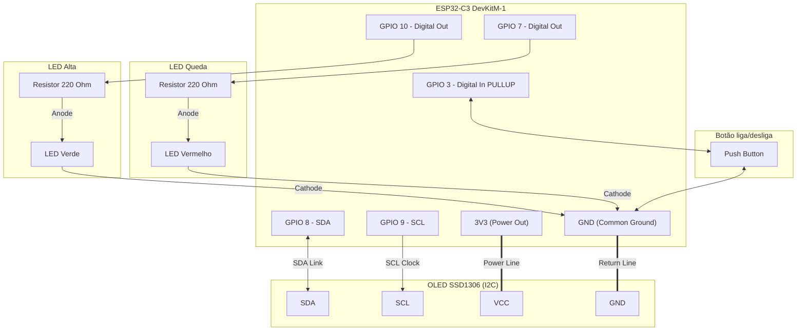

# ESP32-C3 IoT Bitcoin Price Tracker & 24h Trend Indicator

[](diagram.json)
[](sketch.ino)
[](https://www.espressif.com/en/products/socs/esp32-c3)
[](LICENSE)

Este projeto consiste em um sistema embarcado desenvolvido para o microcontrolador **ESP32-C3** que consome em tempo real os dados de mercado do Bitcoin (BTC) em relação ao Dólar Americano (USD). Utilizando chamadas seguras **HTTPS** direcionadas à API pública da *CryptoCompare*, o dispositivo processa as informações financeiras e atualiza dinamicamente uma interface gráfica em um display OLED I2C, além de acionar atuadores visuais baseados em LEDs para sinalizar o comportamento do mercado (alta ou queda nas últimas 24 horas).

O firmware foi implementado em C++/Arduino adotando boas práticas de sistemas operacionais e tempo real, incluindo concorrência cooperativa por meio de temporização não-bloqueante (`millis()`), filtro de tratamento físico (*debounce*) para botões e controle estruturado de estados (*Standby* e *Ativo*).

---

## 📌 Funcionalidades Principais

* **Conexão HTTPS Criptografada**: Comunicação segura utilizando a pilha de rede TLS através da biblioteca `WiFiClientSecure` com bypass seletivo de certificado (`setInsecure()`), otimizando o consumo de recursos na validação em simuladores ou prototipagem rápida.
* **Desserialização Eficiente de JSON**: Uso da biblioteca `ArduinoJson` com alocação estática de memória (`StaticJsonDocument`) para extrair dados em profundidade de estruturas complexas no payload HTTP.
* **Máquina de Estados e Modo Standby**: Implementação de controle liga/desliga de hardware via interrupção lógica por botão (GPIO 3), permitindo suspender requisições, apagar os indicadores e o display OLED.
* **Tratamento de Debounce por Software**: Técnica de temporização para eliminar ruídos físicos (*chatter*) no botão de controle, evitando falsos acionamentos.
* **Indicadores Visuais de Tendência (24h)**: Ativação seletiva baseada no registrador digital das portas GPIO:
  * **LED Verde (GPIO 10)**: Ativado quando a variação percentual nas últimas 24h for superior a 0%.
  * **LED Vermelho (GPIO 7)**: Ativado quando a variação percentual nas últimas 24h for inferior a 0%.
* **Interface Gráfica no OLED**: Renderização otimizada no controlador SSD1306 (128x64 pixels) via barramento I2C, exibindo o ícone oficial estilizado do Bitcoin codificado em bitmap na memória flash (`PROGMEM`), o preço atual em USD e o percentual diário de variação formatado.
* **Saída Serial Duplicada**: Logs técnicos estruturados de depuração enviados simultaneamente à saída serial UART (115200 baud) e ao display durante as etapas críticas (boot e conexão de rede).

---

## 📐 Arquitetura do Sistema

### 1. Conexões de Hardware

O diagrama a seguir descreve a topologia física das conexões entre o módulo de desenvolvimento **ESP32-C3 DevKitM-1**, o display OLED SSD1306, os LEDs indicadores com seus respectivos resistores limitadores de corrente e o botão do sistema.



### 2. Fluxograma de Execução do Software

O fluxo de software é estruturado como uma máquina de estados cooperativa no arquivo `sketch.ino`. Ele evita o uso de funções bloqueantes (como `delay()`) no laço de repetição principal (`loop()`), assegurando que a varredura do botão de controle e a atualização do estado do sistema sejam processadas com baixa latência.

```mermaid
stateDiagram-v2
    [*] --> Setup
    Setup --> Conectando_WiFi : Inicializar Periféricos & Interfaces
    Conectando_WiFi --> Loop_Ativo : Conexão Estabelecida com Sucesso
    
    state Loop_Ativo {
        [*] --> Verificar_Botao
        Verificar_Botao --> Botao_Pressionado : Clique Detectado? (Debounced)
        
        state Botao_Pressionado {
            Toggle_Estado : Alterna entre Ativo e Standby
        }
        
        Verificar_Botao --> Checar_Estado : Sem Clique
        Toggle_Estado --> Checar_Estado
        
        state Checar_Estado <<choice>>
        Checar_Estado --> Processar_Filtro_Tempo : se sistemaAtivo == true
        Checar_Estado --> Desligar_Hardware : se sistemaAtivo == false
        
        state Desligar_Hardware {
            Apagar_LEDs : Escreve LOW em GPIO 7 e 10
            Limpar_OLED : Limpa buffer e envia display.display()
            Espera_Inativa : Permanece em Standby (Sem chamadas à API)
        }
        
        state Processar_Filtro_Tempo <<choice>>
        Processar_Filtro_Tempo --> Requisicao_API : se Tempo Atual - Último Tempo maior ou igual a 1 Hora
        Processar_Filtro_Tempo --> Verificar_Botao : se Tempo menor que 1 Hora
        
        state Requisicao_API {
            GET_HTTP : Efetua chamada HTTPS GET
            JSON_Parsing : Desserializa payload da API
            Atualizar_Saidas : Atualiza LEDs e Renderiza Interface Gráfica
        }
        
        Atualizar_Saidas --> Verificar_Botao
        Espera_Inativa --> Verificar_Botao
    end
```

---

## 🛠️ Especificação de Pinos e Conexões

A tabela a seguir apresenta o mapeamento detalhado dos pinos (*Netlist*) configurados no arquivo `diagram.json` para o **ESP32-C3**:

| Componente | Tipo | Identificador do Componente | Pino no ESP32-C3 | Sinal / Protocolo | Nível Lógico / Operação | Função e Detalhes Técnicos |
| :--- | :--- | :--- | :--- | :--- | :--- | :--- |
| **OLED SSD1306** | Tela | `oled1` | `GPIO 8` | I2C (SDA) | Bidirecional | Linha de transmissão de dados do barramento I2C. |
| **OLED SSD1306** | Tela | `oled1` | `GPIO 9` | I2C (SCL) | Saída de Clock | Linha de sincronismo do clock para o display OLED. |
| **LED Verde** | Saída | `led_verde` | `GPIO 10` | Digital Output | HIGH (3.3V) / LOW (0V) | Ativado em alta do Bitcoin (Variação diária $> 0\%$). Conectado a um resistor limitador de $220\Omega$ em série. |
| **LED Vermelho** | Saída | `led_vermelho` | `GPIO 7` | Digital Output | HIGH (3.3V) / LOW (0V) | Ativado em queda do Bitcoin (Variação diária $< 0\%$). Conectado a um resistor limitador de $220\Omega$ em série. |
| **Botão Power** | Entrada | `btn_power` | `GPIO 3` | Digital Input | INPUT_PULLUP (Ativo em LOW) | Botão para alternar entre Ativo e Standby. O resistor interno de pull-up garante estado HIGH estável enquanto solto. |
| **Alimentação** | Energia | — | `3V3` | Power Out | 3.3V contínuo | Linha de alimentação positiva dos circuitos de hardware. |
| **GND** | Energia | — | `GND` | Common Ground | 0V | Referência de tensão comum para todo o circuito. |

---

## 💻 Estrutura e Lógica do Software

O comportamento lógico do firmware é subdividido em componentes focados, implementando técnicas para robustez em sistemas embarcados:

### 1. Temporização Não-Bloqueante
Em sistemas embarcados de controle único, o uso de `delay()` suspende a execução da CPU, impedindo a leitura instantânea de entradas físicas. No projeto, a temporização é executada de forma assíncrona baseada na função nativa `millis()`, que retorna o tempo decorrido desde o boot:
```cpp
unsigned long tempoAtual = millis();
if (tempoAtual - ultimoTempoRequisicao >= intervaloRequisicao) {
    executarRequisicaoAPI();
    ultimoTempoRequisicao = tempoAtual;
}
```

### 2. Filtro de Tratamento de Ruído (*Debouncing*)
Botões mecânicos geram ruídos elétricos oscilantes ao serem pressionados/soltos. Para evitar leituras fantasmas ou múltiplos disparos, a função `verificarBotao()` valida o acionamento através de uma janela temporal mínima (200 ms):
```cpp
if (estadoAtualBotao == HIGH && ultimoEstadoBotao == LOW) {
    if (millis() - ultimoTempoDebounce > tempoEsperaDebounce) {
        sistemaAtivo = !sistemaAtivo;
        ultimoTempoDebounce = millis();
        // ... controle das saídas correspondentes ...
    }
}
```

### 3. Modelo de Dados JSON da API
A consulta segura retorna um payload do tipo `application/json` estruturado. A extração dos valores utiliza filtros da biblioteca `ArduinoJson` para acessar a estrutura aninhada:
* **Preço Atual**: `doc["RAW"]["BTC"]["USD"]["PRICE"]` (Tipo: `float`)
* **Variação 24h**: `doc["RAW"]["BTC"]["USD"]["CHANGEPCT24HOUR"]` (Tipo: `float`)

---

## 🚀 Como Executar o Projeto

Você pode rodar este projeto tanto de forma 100% simulada no ambiente virtual Wokwi quanto carregar o código para uma placa física.

### Cenário A: Simulação Virtual

#### Opção 1: VS Code com Wokwi Simulator
1. Certifique-se de ter a extensão oficial do **Wokwi Simulator** instalada em seu VS Code.
2. Clone este repositório para o seu diretório de trabalho:
   ```bash
   git clone https://github.com/seu-usuario/bitcoin-price-tracker.git
   ```
3. Abra a pasta correspondente no VS Code.
4. Inicialize o ambiente virtual de simulação:
   * Pressione a tecla `F1` para abrir a paleta de comandos do editor.
   * Digite e selecione: `Wokwi: Start Simulator`.
   * A tela virtual carregará os parâmetros especificados em `diagram.json` e inicializará o interpretador do microcontrolador.

#### Opção 2: Plataforma Web Wokwi
1. Acesse o portal oficial [Wokwi](https://wokwi.com).
2. Selecione a arquitetura **ESP32-C3** para criar um novo projeto em branco.
3. Copie o conteúdo dos respectivos arquivos locais para a interface web:
   * Substitua o código de `sketch.ino` pelo editor correspondente.
   * Substitua a definição estrutural do circuito contida no arquivo `diagram.json`.
4. Clique em **Start Simulation (Play)** para rodar o circuito virtual integrado diretamente no navegador.

---

### Cenário B: Compilação para Placa Física

#### 1. Preparação do Hardware
Adquira os seguintes componentes:
* 1x Microcontrolador **ESP32-C3 DevKitM-1** (ou variante compatível com o pinout).
* 1x Display OLED **SSD1306 128x64** (com suporte a comunicação por barramento I2C).
* 1x LED Verde, 1x LED Vermelho.
* 2x Resistores de $220\Omega$ (para proteção dos LEDs).
* 1x Chave Táctil (*Push button*) de 2 pinos.
* Jumpers de conexão e protoboard.

#### 2. Configuração de Credenciais WiFi
Crie ou edite o arquivo [secrets.h](file:///home/victor-meireles/Documents/faculdade/iot/bitcoin-price-tracker/secrets.h) localizado no mesmo diretório de compilação. Este arquivo deve conter a definição das credenciais da sua rede local sem fio:
```cpp
#define SECRETS_SSID "NOME_DA_SUA_REDE"
#define SECRETS_PASSWORD "SENHA_DA_SUA_REDE"
```
> [!NOTE]
> No arquivo de firmware (`sketch.ino`), as variáveis do sistema de conexão referenciam as definições do arquivo de segurança. Caso haja discrepância entre os nomes de constantes definidas, certifique-se de mapeá-las corretamente como mostrado acima.

#### 3. Instalação de Bibliotecas no Editor (Arduino IDE)
No painel do gerenciador de dependências, pesquise e instale exatamente as seguintes bibliotecas:
1. **Adafruit SSD1306** (Versão estável recomendada: `v2.5.11` ou superior)
2. **Adafruit GFX Library** (Versão estável recomendada: `v1.11.11` ou superior)
3. **ArduinoJson** (Compatível com versões `v6.x` ou `v7.x`)

#### 4. Upload do Firmware
1. Conecte o ESP32-C3 ao computador usando um cabo USB com transmissão de dados.
2. Na sua IDE de preferência (Arduino IDE, VS Code + PlatformIO), selecione a porta serial correta associada à placa conectada.
3. Defina a placa alvo de compilação como `ESP32-C3 Dev Module`.
4. Compile e execute o upload do sketch para o microcontrolador.
5. Abra o Monitor Serial para acompanhar a saída de debug na taxa padrão de **115200 bps**.

---

## 📦 Detalhe das Dependências

As bibliotecas externas listadas são componentes principais na compilação bem-sucedida do firmware:

* **[Adafruit SSD1306](https://github.com/adafruit/Adafruit_SSD1306)**: Biblioteca de baixo nível para gerenciar a inicialização e o envio de dados da memória física para os registradores internos do circuito de display.
* **[Adafruit GFX](https://github.com/adafruit/Adafruit-GFX-Library)**: Fornece classes abstratas de primitivos gráficos (linhas, círculos, renderização de bitmaps customizados na tela, alinhamento de texto e tratamento de matriz de fontes).
* **[ArduinoJson](https://github.com/bblanchon/ArduinoJson)**: Biblioteca de desserialização JSON rápida projetada especificamente para arquiteturas embarcadas com recursos limitados de memória SRAM.

---

## 📝 Licença e Informações Acadêmicas

Este projeto é disponibilizado sob a licença de código aberto **MIT** (Consulte o arquivo [LICENSE](LICENSE) para obter detalhes). Foi construído como um trabalho prático direcionado à disciplina acadêmica de **Fundamentos de Internet das Coisas (IOT)**. 

Contribuições acadêmicas, clonagens estruturais, melhorias na lógica e expansões de novos ativos são incentivadas e de uso inteiramente livre.
